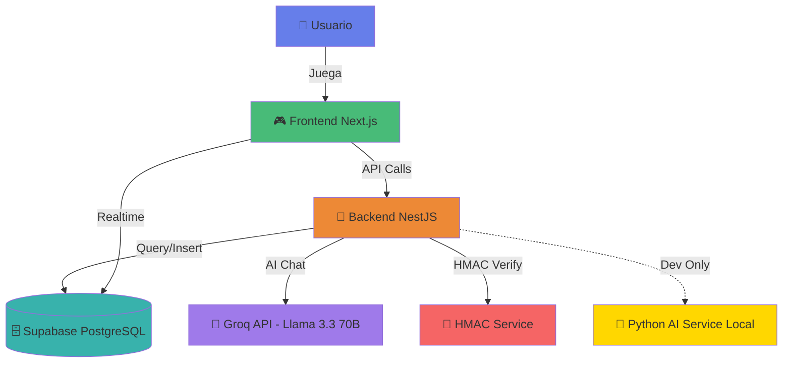

<div align="center">

# 🎮 Gender Quest

### Plataforma Educativa Interactiva sobre Roles de Género

[](https://opensource.org/licenses/MIT)
[](https://github.com/AnderssonProgramming/psoc-genericR-culturalC)
[](https://nextjs.org/)
[](https://nestjs.com/)
[](https://www.typescriptlang.org/)
[](https://supabase.com/)
[](https://threejs.org/)
[](https://groq.com/)

*Jugando aprendemos igualdad* 🌟

[🚀 Demo en Vivo](https://psoc-generic-r-cultural-c.vercel.app/) | [📖 Documentación](#-tabla-de-contenidos) | [💻 Código Fuente](https://github.com/AnderssonProgramming/psoc-genericR-culturalC) | [🤝 Contribuir](#-contribuir)

</div>

---

## 🌐 Despliegue

<div align="center">

### 🚀 Servicios en Producción

| Servicio | Plataforma | Estado | URL |
|----------|-----------|---------|-----|
| **🎨 Frontend** | Vercel | ✅ Activo | [psoc-generic-r-cultural-c.vercel.app](https://psoc-generic-r-cultural-c.vercel.app/) |
| **⚡ Backend API** | Azure Web App | ✅ Activo | [sorokina-c2end0bphkcaf4ab.canadacentral-01.azurewebsites.net/api](https://sorokina-c2end0bphkcaf4ab.canadacentral-01.azurewebsites.net/api) |
| **🔄 Backend (Alt)** | Railway | 🟡 Inactivo* | [psoc-genericr-culturalc-production.up.railway.app/api](https://psoc-genericr-culturalc-production.up.railway.app/api) |
| **🗄️ Base de Datos** | Supabase | ✅ Activo | PostgreSQL Cloud |
| **🤖 AI Service** | Railway | ✅ Activo | Python + Groq API |

<sub>* El backend de Railway está inactivo pero se puede activar en cualquier momento como respaldo</sub>

### 🔗 Endpoints Principales

- **Health Check**: [`/api`](https://sorokina-c2end0bphkcaf4ab.canadacentral-01.azurewebsites.net/api)
- **Quiz**: [`/api/quiz`](https://sorokina-c2end0bphkcaf4ab.canadacentral-01.azurewebsites.net/api/quiz)
- **Leaderboard**: [`/api/leaderboard`](https://sorokina-c2end0bphkcaf4ab.canadacentral-01.azurewebsites.net/api/leaderboard)
- **Chat AI**: [`/api/chat`](https://sorokina-c2end0bphkcaf4ab.canadacentral-01.azurewebsites.net/api/chat)

</div>

---

## 📖 Tabla de Contenidos

- [Sobre el Proyecto](#-sobre-el-proyecto)
- [Características Principales](#-características-principales)
- [Arquitectura](#️-arquitectura)
- [Stack Tecnológico](#-stack-tecnológico)
- [Instalación](#-instalación)
- [Uso](#-uso)
- [Estructura del Proyecto](#-estructura-del-proyecto)
- [API Endpoints](#-api-endpoints)
- [Base de Datos](#-base-de-datos)
- [Seguridad](#-seguridad)
- [Testing](#-testing)
- [Despliegue](#-despliegue)
- [Contribuir](#-contribuir)
- [Licencia](#-licencia)
- [Autores](#-autores)

---

## 🌟 Sobre el Proyecto

**Gender Quest** es una plataforma educativa interactiva que combina gamificación, inteligencia artificial y contenido multimedia para promover la reflexión crítica sobre roles de género, estereotipos y la importancia de la equidad. 

El proyecto integra:
- 🎯 **Juego web 3D** con Three.js y preguntas interactivas
- 🤖 **Chatbot educativo AI** con Groq (Llama 3.3 70B) sobre roles de género
- 📊 **Sistema de ranking** en tiempo real
- 📚 **8 secciones educativas** con contenido multimedia
- 🎵 **Música ambiente** con controles personalizados
- 💬 **Chat flotante** minimizable en todas las páginas
- 🔐 **Autenticación segura** con JWT y verificación HMAC

### 🎯 Objetivos del Proyecto

- ✨ Educar sobre roles de género a través de la gamificación
- 🌍 Promover la igualdad y equidad de género
- 📖 Proporcionar contenido educativo accesible y atractivo
- 🎮 Crear experiencias de aprendizaje interactivas e inmersivas

---

## ✨ Características Principales

### 🎮 Juego Interactivo 3D

- **10 Preguntas Educativas**: Sobre roles de género
- **Experiencia 3D Inmersiva**: Visualización con Three.js y React Three Fiber
- **Sistema de Puntaje**: Puntuación en tiempo real y feedback inmediato
- **⏱️ Temporizador Competitivo**: Registra el tiempo de completado para usuarios autenticados
- **Códigos HMAC**: Verificación criptográfica de resultados con tiempo incluido
- **Pantallas Dinámicas**: Bienvenida, juego, y resultados animados
- **Modo Invitado**: Opción para jugar sin registro (sin temporizador)

### 🤖 Chatbot AI Educativo

- **Groq API (Llama 3.3 70B)**: Modelo de lenguaje de última generación
- **Interfaz Flotante Minimizable**: Disponible en todas las páginas con botón para minimizar
- **Chat de Página Completa**: Interfaz dedicada con tema oscuro y diseño moderno
- **Historial de Conversación**: Guarda el contexto de la sesión
- **Respuestas Educativas**: Enfocadas en equidad e igualdad de género
- **Desarrollo Local Opcional**: Python AI Service con transformers para desarrollo sin API

### 📊 Ranking Global

- **Leaderboard en Tiempo Real**: Actualización automática con Supabase
- **Top Jugadores**: Muestra los mejores puntajes verificados
- **⏱️ Desempate por Tiempo**: Usuarios con mismo puntaje se ordenan por menor tiempo
- **Columna de Tiempo**: Muestra tiempo de completado en formato mm:ss
- **Estadísticas**: Puntaje, precisión, tiempo y fecha de envío
- **Perfiles de Usuario**: Avatares y nombres de usuario
- **Ordenamiento Inteligente**: Score DESC → Tiempo ASC → Fecha ASC

### 🔐 Autenticación Segura

- **Registro e Inicio de Sesión**: Con validación de formularios
- **JWT Tokens**: Sesiones seguras con Passport.js
- **Protección de Rutas**: Guards para páginas privadas
- **Hash de Contraseñas**: bcrypt con salt rounds

### 📚 Contenido Educativo

- **8 Secciones Temáticas**: Basadas en contenido académico sobre roles de género
- **Navegación Intuitiva**: Cards con vista previa y animaciones
- **Responsive Design**: Adaptado a móvil, tablet y desktop
- **Material Multimedia**: Texto, gráficos y contenido interactivo
- **Referencias Bibliográficas**: Formato APA 7ma edición con 11 fuentes académicas
- **Marco Conceptual**: Análisis cultural, factores principales y escalas de interacción

### 🎨 Experiencia de Usuario

- **🎵 Música Ambiente**: Reproductor con controles personalizados en todas las páginas
- **💬 Chatbot Flotante**: Minimizable con botón circular en esquina inferior
- **📱 QR Code Modal**: Comparte tu puntaje con QR personalizado y links de Azure
- **🌐 Código Abierto**: Link prominente al repositorio de GitHub en página principal
- **🎯 Animaciones Fluidas**: Framer Motion en toda la aplicación
- **🌙 Tema Oscuro**: Diseño moderno con gradientes púrpura/fucsia

---

## 🏗️ Arquitectura



### Flujo de Datos

1. **Usuario juega** en el frontend (Three.js 3D)
2. **Frontend genera código** HMAC con resultados
3. **Backend valida** el código HMAC
4. **Si es válido**, guarda en Supabase
5. **Leaderboard actualiza** en tiempo real
6. **Chatbot procesa** preguntas con Groq API (Llama 3.3 70B)

---

## 🚀 Stack Tecnológico

### Frontend

| Tecnología | Versión | Propósito |
|------------|---------|-----------|
| ⚛️ **Next.js** | 16.0 | Framework React con App Router |
| 📘 **TypeScript** | 5.3 | Tipado estático |
| 🎨 **Tailwind CSS** | 3.4 | Estilos utility-first |
| 🎭 **Framer Motion** | 11.0 | Animaciones fluidas |
| 🎲 **Three.js** | 0.180 | Gráficos 3D WebGL |
| 🎯 **React Three Fiber** | 9.4 | React renderer para Three.js |
| 📦 **Zustand** | 4.5 | State management ligero |
| 📋 **React Hook Form** | 7.50 | Manejo de formularios |
| ✅ **Zod** | 3.22 | Validación de esquemas |
| 🎨 **Lucide React** | 0.330 | Iconos modernos |

### Backend

| Tecnología | Versión | Propósito |
|------------|---------|-----------|
| 🔴 **NestJS** | 10.0 | Framework Node.js escalable |
| 📘 **TypeScript** | 5.1 | Tipado estático |
| 🗄️ **Supabase** | 2.39 | Base de datos PostgreSQL |
| 🔑 **JWT** | 10.2 | Autenticación con tokens |
| 🛡️ **Passport** | 0.7 | Estrategias de autenticación |
| 🔐 **bcrypt** | 5.1 | Hash de contraseñas |
| 🤖 **Groq SDK** | 0.10 | API para Llama 3.3 70B |
| ✅ **class-validator** | 0.14 | Validación de DTOs |
| 🔄 **RxJS** | 7.8 | Programación reactiva |

### AI Services

| Servicio | Estado | Propósito |
|----------|--------|-----------|
| 🚀 **Groq API** | ✅ Producción | Llama 3.3 70B para chatbot |
| 🐍 **Python AI Service** | 🛠️ Dev Opcional | Transformers local (Flask) |

### Base de Datos

- 🐘 **PostgreSQL** (via Supabase)
- 🔒 **Row Level Security (RLS)**
- ⚡ **Realtime subscriptions**
- 📈 **Indexes optimizados**
- 🔄 **Migrations versionadas**

### Herramientas

- 🧪 **Jest** - Testing unitario
- 🎨 **Prettier** - Code formatting
- 🔍 **ESLint** - Linting
- 📝 **PostCSS** - CSS processing

---

## 📦 Instalación

### Prerrequisitos

Antes de comenzar, asegúrate de tener instalado:

- 📦 **Node.js** 18+ y npm/pnpm
- 🗄️ Cuenta en **[Supabase](https://supabase.com)** (gratis)
- 🔑 Cuenta en **[Groq](https://groq.com)** para API key (gratis)
- 💻 **Git** para clonar el repositorio
- 🐍 **Python 3.10+** (opcional, solo para desarrollo local con AI service)

### 1️⃣ Clonar el Repositorio

```bash
git clone https://github.com/AnderssonProgramming/psoc-genericR-culturalC.git
cd psoc-genericR-culturalC
```

### 2️⃣ Configurar Backend

```bash
cd back

# Instalar dependencias
npm install

# Crear archivo de variables de entorno
cp .env.example .env
```

Edita `back/.env` con tus credenciales:

```env
# Supabase Configuration
SUPABASE_URL=https://tu-proyecto.supabase.co
SUPABASE_ANON_KEY=tu-anon-key-aqui
SUPABASE_SERVICE_KEY=tu-service-key-aqui

# JWT Configuration
JWT_SECRET=genera-uno-con-openssl-rand-base64-32

# HMAC Secret (para verificar códigos del juego)
HMAC_SECRET=genera-otro-con-openssl-rand-base64-32

# Groq AI Configuration (REQUERIDO para chatbot)
GROQ_API_KEY=gsk_tu-api-key-aqui

# Python AI Service (OPCIONAL - Solo para desarrollo local)
USE_LOCAL_MODEL=false
PYTHON_AI_SERVICE_URL=http://localhost:5000

# Server Configuration
PORT=3001
FRONTEND_URL=http://localhost:3000
NODE_ENV=development
```

**Generar secrets seguros:**

```bash
# En Linux/Mac
openssl rand -base64 32

# En Windows PowerShell
[Convert]::ToBase64String((1..32 | ForEach-Object { Get-Random -Maximum 256 }))
```

### 3️⃣ Configurar Base de Datos (Supabase)

1. Crea un proyecto en [Supabase](https://app.supabase.com)
2. Ve a **SQL Editor** en el dashboard
3. Ejecuta el contenido de `back/supabase/migrations/001_initial_schema.sql`
4. Verifica que las tablas se hayan creado correctamente

### 4️⃣ Configurar Frontend

```bash
cd ../front

# Instalar dependencias
npm install

# Crear archivo de variables de entorno
cp .env.local.example .env.local
```

Edita `front/.env.local`:

```env
# API Backend URL
NEXT_PUBLIC_API_URL=http://localhost:3001/api

# Supabase Configuration (mismas que el backend)
NEXT_PUBLIC_SUPABASE_URL=https://tu-proyecto.supabase.co
NEXT_PUBLIC_SUPABASE_ANON_KEY=tu-anon-key-aqui
```

### 5️⃣ Iniciar Servidores de Desarrollo

**Terminal 1 - Backend:**

```bash
cd back
npm run start:dev
```

✅ Backend corriendo en: `http://localhost:3001/api`

**Terminal 2 - Frontend:**

```bash
cd front
npm run dev
```

✅ Frontend corriendo en: `http://localhost:3000`

### 6️⃣ Verificar Instalación

1. Abre tu navegador en `http://localhost:3000`
2. Regístrate como nuevo usuario
3. Inicia sesión
4. Prueba el juego en `/game`
5. Interactúa con el chatbot (botón flotante)
6. Revisa el leaderboard en `/leaderboard`
7. Explora las secciones educativas en `/sections`

---

## 🎮 Uso

### 🎯 Para Jugadores

1. **Registro/Login**: Crea una cuenta o inicia sesión
2. **Jugar**: Ve a `/game` y responde las 10 preguntas
3. **Ver Resultados**: Al finalizar, verás tu puntaje y estadísticas
4. **Ranking**: Compite en el leaderboard global
5. **Chatbot**: Pregunta sobre roles de género en cualquier página
6. **Secciones**: Explora contenido educativo adicional

### 👩‍🏫 Para Educadores

1. **Asignar Tareas**: Pide a estudiantes completar el juego
2. **Monitorear Progreso**: Revisa el leaderboard para ver participación
3. **Facilitar Discusiones**: Usa el chatbot para responder preguntas
4. **Contenido Complementario**: Utiliza las 8 secciones educativas
5. **Gamificación**: Crea desafíos basados en los puntajes

---

## 📂 Estructura del Proyecto

```
psoc-genericR-culturalC/
│
├── 📁 front/                      # Frontend Next.js
│   ├── 📁 app/                    # App Router (Next.js 13+)
│   │   ├── page.tsx               # 🏠 Landing page
│   │   ├── layout.tsx             # Layout global
│   │   ├── globals.css            # Estilos globales
│   │   ├── 📁 login/              # 🔐 Página de login
│   │   ├── 📁 register/           # ✍️ Página de registro
│   │   ├── 📁 game/               # 🎮 Juego interactivo
│   │   │   ├── QuizGameClient.tsx # Cliente del juego principal
│   │   │   ├── ThreeScene.tsx     # Escena 3D con Three.js
│   │   │   ├── WelcomeScreen.tsx  # Pantalla de bienvenida
│   │   │   ├── QuizCard.tsx       # Tarjeta de pregunta
│   │   │   └── ResultsScreen.tsx  # Pantalla de resultados
│   │   ├── 📁 leaderboard/        # 🏆 Ranking global
│   │   ├── 📁 chat/               # 💬 Página de chat
│   │   └── 📁 sections/           # 📚 Secciones educativas
│   ├── 📁 components/             # Componentes reutilizables
│   │   ├── NavBar.tsx             # Barra de navegación
│   │   └── FloatingChatbot.tsx    # Chatbot flotante
│   ├── 📁 lib/                    # Utilidades y configuración
│   │   ├── api.ts                 # Cliente API (axios)
│   │   ├── supabase.ts            # Cliente Supabase
│   │   ├── auth-context.tsx       # Context de autenticación
│   │   ├── theme.ts               # Configuración de tema
│   │   └── utils.ts               # Helpers y utilidades
│   ├── 📁 public/                 # Archivos estáticos
│   ├── package.json               # Dependencias frontend
│   ├── tsconfig.json              # Configuración TypeScript
│   ├── tailwind.config.ts         # Configuración Tailwind
│   └── next.config.js             # Configuración Next.js
│
├── 📁 back/                       # Backend NestJS
│   ├── 📁 src/                    # Código fuente
│   │   ├── main.ts                # Entry point
│   │   ├── app.module.ts          # Módulo raíz
│   │   ├── 📁 auth/               # 🔐 Módulo de autenticación
│   │   │   ├── auth.service.ts    # Lógica de auth (JWT, bcrypt)
│   │   │   ├── auth.controller.ts # Endpoints /register, /login
│   │   │   ├── jwt.strategy.ts    # Estrategia JWT Passport
│   │   │   ├── jwt-auth.guard.ts  # Guard para rutas protegidas
│   │   │   └── 📁 dto/            # DTOs de autenticación
│   │   ├── 📁 quiz/               # 🎯 Módulo de quiz
│   │   │   ├── quiz.service.ts    # Lógica del juego
│   │   │   └── quiz.controller.ts # Endpoints del quiz
│   │   ├── 📁 scores/             # 📊 Módulo de puntajes
│   │   │   ├── scores.service.ts  # Verificación HMAC, guardado
│   │   │   ├── scores.controller.ts # POST /scores
│   │   │   └── 📁 dto/            # DTOs de scores
│   │   ├── 📁 leaderboard/        # 🏆 Módulo de ranking
│   │   │   ├── leaderboard.service.ts
│   │   │   └── leaderboard.controller.ts # GET /leaderboard
│   │   ├── 📁 chat/               # 💬 Módulo de chatbot
│   │   │   ├── chat.service.ts    # Integración OpenAI
│   │   │   ├── chat.controller.ts # POST /chat
│   │   │   └── 📁 dto/            # DTOs de chat
│   │   ├── 📁 common/             # 🛠️ Servicios compartidos
│   │   │   └── hmac.service.ts    # Verificación HMAC-SHA256
│   │   └── 📁 supabase/           # 🗄️ Módulo Supabase
│   │       └── supabase.module.ts # Cliente Supabase provider
│   ├── 📁 supabase/migrations/    # Migraciones SQL
│   │   └── 001_initial_schema.sql # Schema inicial
│   ├── 📁 migrations/             # Migraciones adicionales
│   │   └── 004_create_game_codes.sql
│   ├── package.json               # Dependencias backend
│   ├── tsconfig.json              # Configuración TypeScript
│   ├── nest-cli.json              # Configuración NestJS CLI
│   └── jest.config.js             # Configuración Jest
│
├── 📄 README.md                   # Este archivo
├── 📄 LICENSE                     # Licencia MIT
└── 📄 sections.txt                # Contenido de secciones
```

---

## 🔌 API Endpoints

### 🔐 Autenticación

| Método | Endpoint | Descripción | Auth |
|--------|----------|-------------|------|
| `POST` | `/api/auth/register` | Registrar nuevo usuario | No |
| `POST` | `/api/auth/login` | Iniciar sesión y obtener JWT | No |
| `GET` | `/api/auth/profile` | Obtener perfil del usuario | Sí |

**Ejemplo - Registro:**

```json
POST /api/auth/register
{
  "username": "jugador123",
  "email": "jugador@example.com",
  "password": "password123"
}
```

**Respuesta:**

```json
{
  "id": "uuid-here",
  "username": "jugador123",
  "email": "jugador@example.com",
  "created_at": "2025-10-27T10:30:00Z"
}
```

### 🎯 Quiz

| Método | Endpoint | Descripción | Auth |
|--------|----------|-------------|------|
| `GET` | `/api/quiz/questions` | Obtener preguntas del quiz | Sí |
| `POST` | `/api/quiz/submit` | Enviar respuestas del quiz | Sí |

### 📊 Puntajes

| Método | Endpoint | Descripción | Auth |
|--------|----------|-------------|------|
| `POST` | `/api/scores` | Enviar y verificar código HMAC | Sí |
| `GET` | `/api/scores/user/:userId` | Obtener puntajes de un usuario | Sí |

**Ejemplo - Enviar Score:**

```json
POST /api/scores
{
  "submission_code": "user123|850|28|30|1730024400|a3d8f9e2c1b0..."
}
```

### 🏆 Leaderboard

| Método | Endpoint | Descripción | Auth |
|--------|----------|-------------|------|
| `GET` | `/api/leaderboard` | Top 50 jugadores | No |
| `GET` | `/api/leaderboard/stats` | Estadísticas globales | No |

**Respuesta Leaderboard:**

```json
[
  {
    "id": "uuid",
    "username": "jugador123",
    "score": 950,
    "correct_answers": 29,
    "total_questions": 30,
    "submitted_at": "2025-10-27T10:30:00Z"
  }
]
```

### 💬 Chatbot

| Método | Endpoint | Descripción | Auth |
|--------|----------|-------------|------|
| `POST` | `/api/chat` | Enviar mensaje al chatbot AI | Sí |
| `GET` | `/api/chat/history` | Obtener historial de chat | Sí |

**Ejemplo - Chat:**

```json
POST /api/chat
{
  "message": "¿Qué son los roles de género?"
}
```

---

## 🗄️ Base de Datos

### Schema PostgreSQL (Supabase)

#### Tabla: `users`

```sql
CREATE TABLE users (
  id UUID PRIMARY KEY DEFAULT uuid_generate_v4(),
  username TEXT UNIQUE NOT NULL,
  email TEXT UNIQUE NOT NULL,
  password_hash TEXT NOT NULL,
  avatar_url TEXT,
  created_at TIMESTAMP WITH TIME ZONE DEFAULT NOW()
);
```

#### Tabla: `scores`

```sql
CREATE TABLE scores (
  id UUID PRIMARY KEY DEFAULT uuid_generate_v4(),
  user_id UUID NOT NULL REFERENCES users(id) ON DELETE CASCADE,
  score INTEGER NOT NULL,
  correct_answers INTEGER NOT NULL,
  total_questions INTEGER NOT NULL,
  completion_time_seconds INTEGER, -- ⏱️ Tiempo de completado en segundos (nuevo)
  submission_code TEXT UNIQUE NOT NULL,
  verified BOOLEAN DEFAULT FALSE,
  submitted_at TIMESTAMP WITH TIME ZONE DEFAULT NOW()
);
```

#### Tabla: `game_codes`

```sql
CREATE TABLE game_codes (
  id UUID PRIMARY KEY DEFAULT uuid_generate_v4(),
  code TEXT UNIQUE NOT NULL,
  user_id UUID REFERENCES users(id),
  username TEXT NOT NULL,
  score INTEGER NOT NULL,
  correct_answers INTEGER NOT NULL,
  total_questions INTEGER NOT NULL,
  completion_time INTEGER, -- ⏱️ Tiempo de completado en segundos (nuevo)
  hmac TEXT NOT NULL,
  created_at TIMESTAMP WITH TIME ZONE DEFAULT NOW(),
  expires_at TIMESTAMP WITH TIME ZONE DEFAULT NOW() + INTERVAL '24 hours'
);
```

#### Tabla: `chat_sessions`

```sql
CREATE TABLE chat_sessions (
  id UUID PRIMARY KEY DEFAULT uuid_generate_v4(),
  user_id UUID NOT NULL REFERENCES users(id) ON DELETE CASCADE,
  messages JSONB DEFAULT '[]'::jsonb,
  started_at TIMESTAMP WITH TIME ZONE DEFAULT NOW()
);
```

#### Tabla: `analytics_events`

```sql
CREATE TABLE analytics_events (
  id UUID PRIMARY KEY DEFAULT uuid_generate_v4(),
  event_type TEXT NOT NULL,
  metadata JSONB DEFAULT '{}'::jsonb,
  timestamp TIMESTAMP WITH TIME ZONE DEFAULT NOW()
);
```

### Índices Optimizados

```sql
CREATE INDEX idx_scores_user_id ON scores(user_id);
CREATE INDEX idx_scores_score ON scores(score DESC);
CREATE INDEX idx_scores_completion_time ON scores(completion_time_seconds); -- ⏱️ Índice para ordenamiento por tiempo
CREATE INDEX idx_scores_verified ON scores(verified);
CREATE INDEX idx_chat_sessions_user_id ON chat_sessions(user_id);
CREATE INDEX idx_analytics_event_type ON analytics_events(event_type);
CREATE INDEX idx_game_codes_code ON game_codes(code);
CREATE INDEX idx_game_codes_expires ON game_codes(expires_at);
```

### Row Level Security (RLS)

```sql
-- Usuarios pueden leer su propia información
CREATE POLICY "Users can read own data" ON users
  FOR SELECT USING (auth.uid() = id);

-- Todos pueden leer scores verificados (leaderboard)
CREATE POLICY "Anyone can read verified scores" ON scores
  FOR SELECT USING (verified = true);

-- Usuarios solo pueden insertar sus propios scores
CREATE POLICY "Users can insert own scores" ON scores
  FOR INSERT WITH CHECK (auth.uid() = user_id);
```

---

## 🔐 Seguridad

### Verificación de Códigos HMAC

**Algoritmo de Verificación:**

1. **Frontend genera código**:
   ```
   username|score|correct|total|timestamp|hmac_hash
   ```

2. **Backend verifica**:
   ```typescript
   const payload = `${username}|${score}|${correct}|${total}|${timestamp}`;
   const expectedHash = crypto
     .createHmac('sha256', HMAC_SECRET)
     .update(payload)
     .digest('hex');
   
   if (hash !== expectedHash) throw new Error('Invalid code');
   ```

3. **Validaciones adicionales**:
   - ✅ Timestamp no mayor a 7 días
   - ✅ Código único (no usado previamente)
   - ✅ Usuario autenticado válido

### Autenticación JWT

- 🔑 **Tokens firmados** con HS256
- ⏰ **Expiración**: 7 días
- 🛡️ **Refresh tokens**: Para sesiones largas
- 🔒 **Guards**: Protección de rutas sensibles

### Hash de Contraseñas

```typescript
// Registro
const salt = await bcrypt.genSalt(10);
const passwordHash = await bcrypt.hash(password, salt);

// Login
const isMatch = await bcrypt.compare(password, user.password_hash);
```

### CORS

```typescript
app.enableCors({
  origin: process.env.FRONTEND_URL || 'http://localhost:3000',
  credentials: true,
});
```

---

## 🧪 Testing

### Backend Tests

```bash
cd back

# Ejecutar todos los tests
npm run test

# Tests con watch mode
npm run test:watch

# Cobertura de tests
npm run test:cov

# E2E tests
npm run test:e2e
```

### Frontend Tests (Futuro)

```bash
cd front

# Unit tests con Jest
npm run test

# Tests con watch mode
npm run test:watch

# E2E tests con Playwright
npm run test:e2e
```

---

## 🚀 Despliegue

### 🌟 Arquitectura de Despliegue Actual

```
┌─────────────────────────────────────────────────────┐
│         🌐 USUARIOS FINALES                          │
└────────────────┬────────────────────────────────────┘
                 │
    ┌────────────▼────────────┐
    │    Vercel CDN           │  ← Frontend (Next.js)
    │  psoc-generic-r...      │     Optimizado con SSR
    └────────────┬────────────┘
                 │
    ┌────────────▼────────────────────────┐
    │  Azure Web App (Principal)          │  ← Backend NestJS
    │  sorokina-c2end0bphkc...            │     Region: Canada Central
    └────────────┬────────────────────────┘
                 │
                 ├─────► 🗄️ Supabase PostgreSQL (Cloud)
                 ├─────► 🤖 Groq API (Llama 3.3 70B)
                 └─────► 🐍 Python AI Service (Railway - Opcional)
                 
    ┌────────────────────────┐
    │  Railway (Respaldo)    │  ← Backend alternativo
    │  🟡 Inactivo           │     (Se puede activar)
    └────────────────────────┘
```

### ✅ Despliegue en Producción

#### 🎨 **Frontend → Vercel**

**Configuración automática:**
1. Push a GitHub → Deploy automático
2. Variables de entorno configuradas
3. Optimización automática con Next.js

**Variables de Entorno (Vercel):**
```env
NEXT_PUBLIC_API_URL=https://sorokina-c2end0bphkcaf4ab.canadacentral-01.azurewebsites.net/api
NEXT_PUBLIC_SUPABASE_URL=https://bxbwhdbfxfcyukitwsnq.supabase.co
NEXT_PUBLIC_SUPABASE_ANON_KEY=tu-anon-key
```

#### ⚡ **Backend → Azure Web App (Principal)**

**Configuración:**
- **Plataforma**: Azure App Service
- **Stack**: Node.js 18 LTS
- **Region**: Canada Central
- **Plan**: B1 (Basic)
- **Deploy**: GitHub Actions (CI/CD automático)

**Variables de Entorno (Azure):**
```env
SUPABASE_URL=https://bxbwhdbfxfcyukitwsnq.supabase.co
SUPABASE_KEY=tu-service-role-key
GROQ_API_KEY=tu-groq-api-key
JWT_SECRET=tu-jwt-secret
FRONTEND_URL=https://psoc-generic-r-cultural-c.vercel.app
HMAC_SECRET=tu-hmac-secret
```

**Health Check**: 
```bash
curl https://sorokina-c2end0bphkcaf4ab.canadacentral-01.azurewebsites.net/api
```

#### 🔄 **Backend → Railway (Alternativo - Inactivo)**

**Estado**: 🟡 Inactivo pero funcional
- Configurado como respaldo del backend
- Puede activarse en cualquier momento
- Mismas variables de entorno que Azure
- URL: `https://psoc-genericr-culturalc-production.up.railway.app/api`

#### 🗄️ **Base de Datos → Supabase**

- PostgreSQL 15 en la nube
- Backup automático diario
- SSL/TLS encryption
- Row Level Security (RLS) habilitado

#### 🤖 **AI Service → Groq API**

- Modelo: Llama 3.3 70B Versatile
- Tier: Free (30 req/min)
- Latencia: ~200-500ms
- Respaldo: Python AI Service en Railway

---

### 🛠️ Configuración de Despliegue Manual

#### Opción 1: Azure Web App (Recomendado)

**1. Crear Web App:**
```bash
az webapp create \
  --resource-group GenderQuest \
  --plan GenderQuestPlan \
  --name sorokina \
  --runtime "NODE|18-lts"
```

**2. Configurar variables de entorno:**
- Azure Portal → App Service → Configuration → Application settings

**3. Configurar CI/CD:**
- GitHub → Settings → Secrets → Add repository secrets
- Azure auto-genera el workflow en `.github/workflows/`

#### Opción 2: Railway (Respaldo)

**1. Crear proyecto:**
```bash
railway init
```

**2. Configurar variables:**
```bash
railway variables set SUPABASE_URL=...
railway variables set GROQ_API_KEY=...
```

**3. Deploy:**
```bash
railway up
```

#### Opción 3: Docker (Auto-hospedado)

**Backend Dockerfile:**
FROM node:18-alpine
WORKDIR /app
COPY back/package*.json ./
RUN npm install
COPY back/ ./
RUN npm run build
CMD ["npm", "run", "start:prod"]
```

```dockerfile
# Dockerfile (frontend)
FROM node:18-alpine
WORKDIR /app
COPY front/package*.json ./
RUN npm install
COPY front/ ./
RUN npm run build
CMD ["npm", "run", "start"]
```

**Docker Compose:**

```yaml
version: '3.8'
services:
  backend:
    build:
      context: .
      dockerfile: Dockerfile.backend
    ports:
      - "3001:3001"
    env_file:
      - back/.env
  
  frontend:
    build:
      context: .
      dockerfile: Dockerfile.frontend
    ports:
      - "3000:3000"
    env_file:
      - front/.env.local
    depends_on:
      - backend
```

---

## 🤝 Contribuir

¡Las contribuciones son bienvenidas! Este es un proyecto educativo de código abierto.

### Cómo Contribuir

1. **Fork** el repositorio
2. **Crea una rama** para tu feature:
   ```bash
   git checkout -b feature/nueva-funcionalidad
   ```
3. **Haz tus cambios** y commitea:
   ```bash
   git commit -m '✨ Agrega nueva funcionalidad'
   ```
4. **Push** a tu rama:
   ```bash
   git push origin feature/nueva-funcionalidad
   ```
5. **Abre un Pull Request** en GitHub

### Estándares de Código

- ✅ Usa **TypeScript** para todo el código
- 📝 Agrega **comentarios** para lógica compleja
- 🧪 Incluye **tests** para nuevas features
- 🎨 Sigue las convenciones de **Prettier** y **ESLint**
- 📖 Actualiza la **documentación** si es necesario

### Reportar Bugs

Si encuentras un bug, por favor [abre un issue](https://github.com/AnderssonProgramming/psoc-genericR-culturalC/issues) con:

- 📝 Descripción del problema
- 🔄 Pasos para reproducir
- 💻 Entorno (OS, Node version, navegador)
- 📸 Screenshots si aplica

---

## 📝 Licencia

Este proyecto está licenciado bajo la **Licencia MIT** - ve el archivo [LICENSE](LICENSE) para más detalles.

```
MIT License

Copyright (c) 2025 Gender Quest

Se concede permiso, de forma gratuita, a cualquier persona que obtenga una copia
de este software y archivos de documentación asociados (el "Software"), para 
utilizar el Software sin restricciones, incluyendo sin limitación los derechos 
a usar, copiar, modificar, fusionar, publicar, distribuir, sublicenciar, y/o 
vender copias del Software...
```

---

## 👥 Autores

Proyecto desarrollado como parte de una iniciativa educativa sobre igualdad de género.

- 💻 **Desarrollo**: [AnderssonProgramming](https://github.com/AnderssonProgramming)
- 🎨 **Diseño**: Equipo Gender Quest
- 📚 **Contenido Educativo**: Basado en documental sobre roles de género

---

## 🆘 Soporte

¿Necesitas ayuda? Aquí hay algunas opciones:

- 📖 **Documentación**: Lee los READMEs de [backend](./back/README.md) y [frontend](./front/README.md)
- 🐛 **Issues**: [Reporta bugs o solicita features](https://github.com/AnderssonProgramming/psoc-genericR-culturalC/issues)
- 💬 **Discusiones**: [Únete a las discusiones](https://github.com/AnderssonProgramming/psoc-genericR-culturalC/discussions)
- 📧 **Email**: Contacta al equipo (especificar email)

### FAQ

**P: ¿El juego funciona en móviles?**  
R: Sí, el frontend es totalmente responsive, pero para mejor experiencia 3D recomendamos desktop.

**P: ¿Necesito pagar por el chatbot AI?**  
R: No, usamos Groq API con su tier gratuito que incluye Llama 3.3 70B. Solo necesitas crear una cuenta gratuita en console.groq.com y obtener tu API key.

**P: ¿Puedo usar esto para mi clase?**  
R: ¡Absolutamente! El proyecto es open source y está diseñado para uso educativo.

---

## 🎯 Roadmap

### ✅ Completado

- [x] Sistema de autenticación JWT
- [x] Juego 3D con Three.js
- [x] Chatbot AI con GPT-4
- [x] Leaderboard en tiempo real
- [x] 8 secciones educativas
- [x] Verificación HMAC de códigos
- [x] Diseño responsive

### 🚧 En Progreso

- [ ] Tests E2E completos
- [ ] Dashboard de analíticas para educadores
- [ ] Exportación de datos (CSV/PDF)

### 🔮 Futuro

- [ ] Integración con Unity WebGL para jugar en navegador
- [ ] Sistema de logros y badges
- [ ] Multi-idioma (i18n - Inglés, Francés, Portugués)
- [ ] Modo oscuro completo
- [ ] PWA para uso offline
- [ ] Sistema de notificaciones push
- [ ] Grupos y aulas virtuales
- [ ] Estadísticas avanzadas de progreso
- [ ] Integración con LMS (Moodle, Canvas)

---

<div align="center">

### 🌟 Si este proyecto te ha sido útil, considera darle una ⭐ en GitHub

**Gender Quest** - Jugando aprendemos igualdad 🎮✨

[🏠 Inicio](#) • [📖 Docs](#-tabla-de-contenidos) • [🐛 Issues](https://github.com/AnderssonProgramming/psoc-genericR-culturalC/issues) • [💬 Discusiones](https://github.com/AnderssonProgramming/psoc-genericR-culturalC/discussions)

---

Hecho con ❤️ para la educación en igualdad de género

</div>

